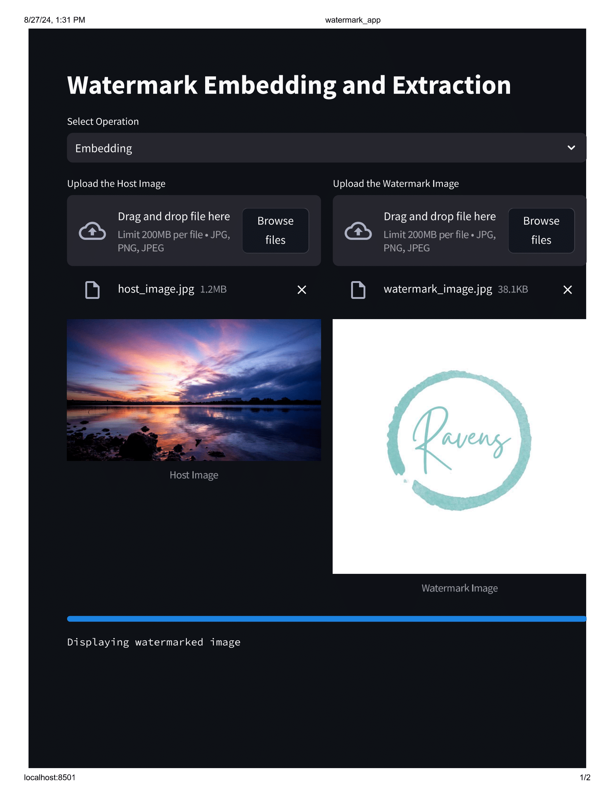
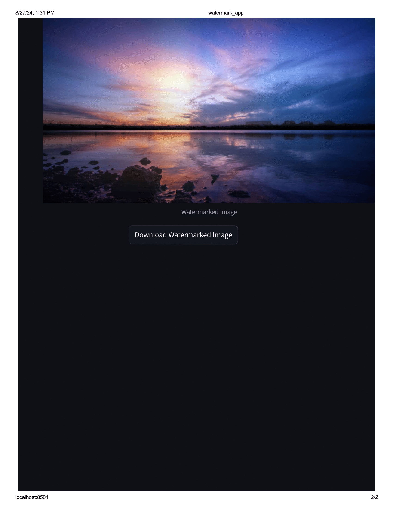
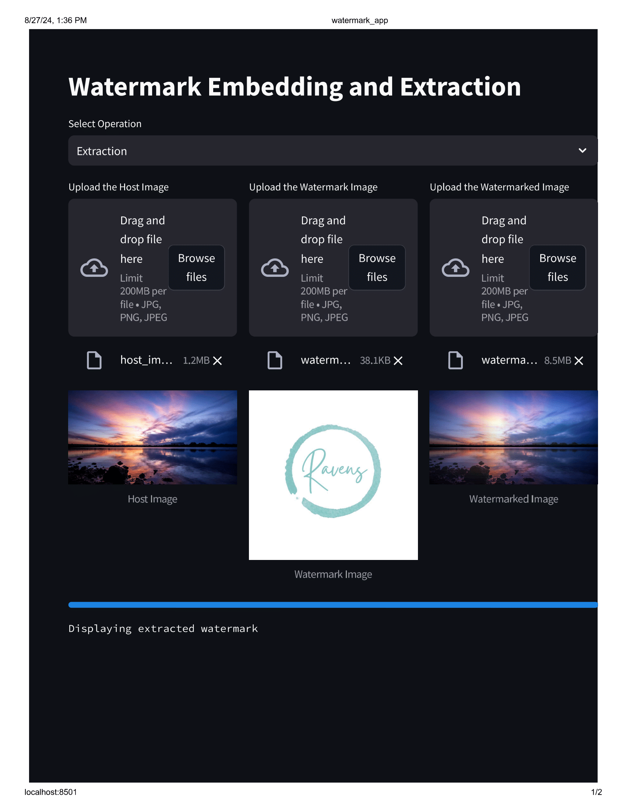

# Watermark Embedding and Extraction Using SVD

This project demonstrates the technique of embedding a watermark into a high-resolution image using Singular Value Decomposition (SVD). The watermark embedding process enhances image security by allowing the original image to be traced back through the extraction process. The project uses Python along with libraries like PIL, NumPy, and OpenCV to handle image processing tasks. The project includes a Streamlit app for a user-friendly interface and a Jupyter Notebook for detailed code execution and analysis.

## Table of Contents

- [Overview](#overview)
- [Features](#features)
- [Installation](#installation)
- [Usage](#usage)
- [Demo](#demo)
- [File Descriptions](#file-descriptions)
- [Contributing](#contributing)
- [Features](#features)
- [Website](#website)
- [Contact Information](#contact-information)
- [License](#license)

## Overview

This repository provides a complete solution for embedding and extracting watermarks in images using SVD. The core functionality is implemented in Python, and the user interface is built with Streamlit for interactive use.

### Key Concepts

- **Watermark Embedding**: Embeds a watermark into a host image by modifying its Singular Values.
- **Watermark Extraction**: Extracts the watermark from a watermarked image using the inverse process.

## Features

- **Streamlit App**: A web-based interface for interactive watermark embedding and extraction.
- **Jupyter Notebook**: Detailed code examples and step-by-step analysis of watermark operations.
- **Support for RGB Images**: Both grayscale and color images are supported.

## Installation

### Prerequisites

1. Ensure you have Python 3.7+ installed. You can download Python from [python.org](https://www.python.org/downloads/).

2. Make sure you have the host image and watermark image saved in the local directory:
   - `host_image.jpg` for the host image
   - `watermark_image.jpg` for the watermark image

### Clone the Repository

```bash
git clone https://github.com/Eemayas/Watermark-Embedding-and-Extraction-Using-SVD.git
cd Watermark-Embedding-and-Extraction-Using-SVD
```

### Install Dependencies

Create and activate a virtual environment (optional but recommended):

```bash
python -m venv venv
source venv/bin/activate  # On Windows use `venv\Scripts\activate`
```

Install required packages:

```bash
pip install -r requirements.txt
```

### Requirements

The `requirements.txt` file includes all necessary libraries:

```plaintext
streamlit
Pillow
numpy
opencv-python
tqdm
```

## Usage

### Streamlit App

1. **Run the App**:

   ```bash
   streamlit run watermark_app.py
   ```

2. **Interact with the App**:

   - **Select Operation**: Choose between "Embedding" or "Extraction".
   - **Upload Images**: Upload the host image, watermark image, and watermarked image as required.
   - **Download Results**: Download the resultant images directly from the app.

### Jupyter Notebook For RGB Images

1. **Open the Notebook**:

   ```bash
   jupyter notebook Final-rgb.ipynb
   ```

2. **Run the Cells**: Execute each cell to see the detailed implementation and results.

### Jupyter Notebook For GrayScale Images

1. **Open the Notebook**:

   ```bash
   jupyter notebook Final-grayscale v2.ipynb
   ```

2. **Run the Cells**: Execute each cell to see the detailed implementation and results.

## Demo
### Embedding


### Extraction



## File Descriptions

- `watermark_app.py`: Streamlit app for watermark embedding and extraction.
- `Final-rgb.ipynb`: Jupyter Notebook containing the watermarking algorithms and analysis for RGB images.
- `Final-grayscale v2.ipynb`: Jupyter Notebook containing the watermarking algorithms and analysis for grayscale images.
- `requirements.txt`: List of Python dependencies required for the project.

## Contributing

Contributions are welcome! Please follow these steps to contribute:

1. Fork the repository.
2. Create a new branch (`git checkout -b feature/your-feature`).
3. Make your changes and commit them (`git commit -am 'Add new feature'`).
4. Push to the branch (`git push origin feature/your-feature`).
5. Create a new Pull Request.

## Features

- **Image Processing**: Utilizes the PIL and OpenCV libraries for image manipulation.
- **Singular Value Decomposition (SVD)**: Embeds and extracts watermarks using SVD, maintaining image integrity.
- **Customizable Alpha Parameter**: Adjust the `alpha` parameter to control the intensity of the watermark.
- **Grayscale Conversion**: Converts images to grayscale for simplicity and reduced computational load.

## Website

Check out the live demo of the application here: [https://watermarking-image-svd.streamlit.app/](https://watermarking-image-svd.streamlit.app/).

## Contact Information

For any questions or further information, feel free to reach out:

- **Name**: Prashant Manandhar
- **Email**: prashantmanandhar2002@gmail.com
- **GitHub**: [Eemayas](https://github.com/Eemayas)
- **Website**:[https://www.manandharprashant.com.np/](https://www.manandharprashant.com.np/)

## Acknowledgements

- **Open Source Libraries**: Thanks to Streamlit, Pillow, NumPy, and OpenCV for their powerful libraries and tools.

---
